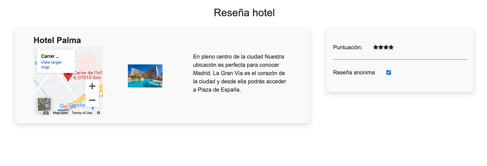
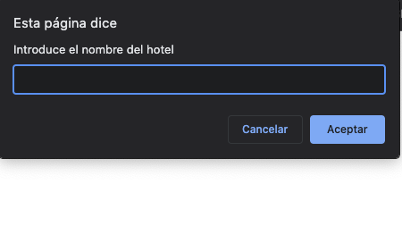
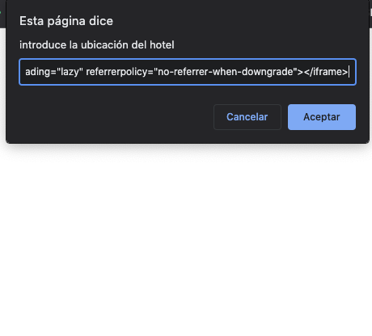
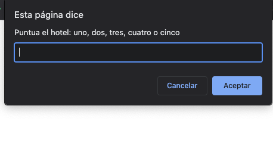

# Lemoncode-hotel review

In this javascript exercise we dynamically create the basic information of a hotel.
Through a prompt we fill in the properties of an object and then insert them in the html.

The properties are:
Name, Location, image, rating and review

